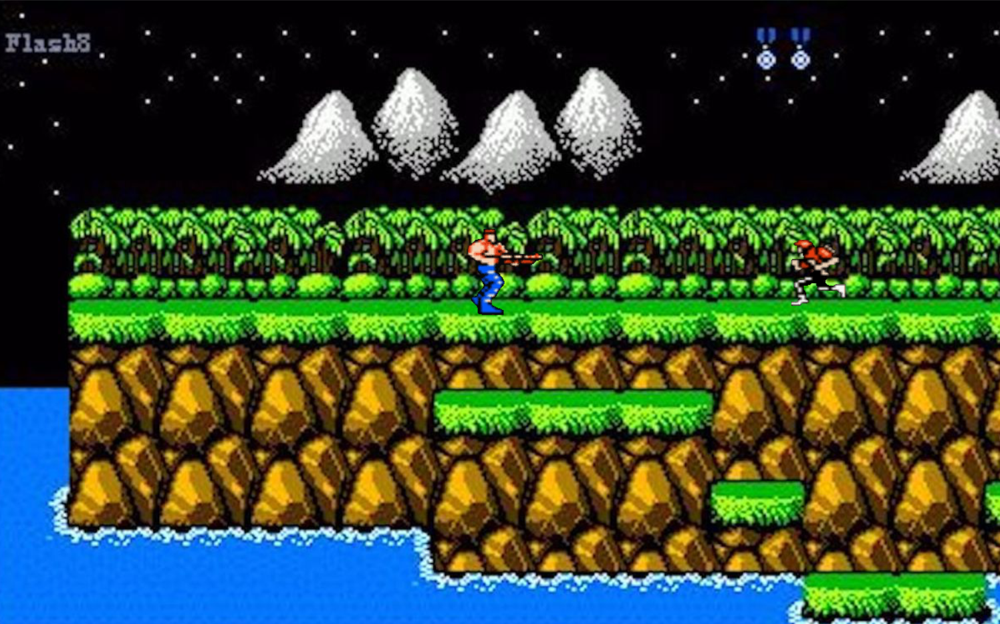

# Jogo Contra


Jogo Contra feito em Python
Um pequeno jogo Contra feito após aprender o básico de Python
Execute o arquivo principal em `src/Contra.py` para jogar:
```bash
python src/Contra.py
```
Este programa não está completo

## Funcionalidades Atuais
* [x] Movimentação do jogador (pular, agachar, correr, mirar)
* [x] Sistema de tiro
* [x] Inimigos básicos e Chefe (Boss)
* [x] Rolagem de tela (Side-scrolling)
* [x] Condição de vitória e derrota

## ToDo (Para fazer)
* [x] Menu inicial
* [x] Efeitos sonoros e Música de fundo
* [x] Adicionar mais fases/níveis (Parcial: lógica pronta, falta desenhar mapas)
* [x] Power-ups (armas diferentes: Spread, Laser, etc.)
* [x] Sistema de pontuação (High Score) aprimorado
* [ ] Mais variedades de inimigos


## Controles
* **W**: Olhar para cima
* **S**: Agachar
* **A**: Mover para a esquerda
* **D**: Mover para a direita
* **K**: Pular
* **J**: Atirar
* **P**: Sair do jogo
